# Ubre — Taxi service that will make you go "Ubre!"

**Ubre** is an academic project made for "Advanced Web Technologies" and "Software construction and testing" courses at Faculty of Technical Sciences, University of Novi Sad.
## Authors

- [@pavleglusac](https://github.com/pavleglusac) SW 19/2019
- [@KatarinaKomad](https://github.com/KatarinaKomad) SW 28/2019
- [@dusanlazic](https://github.com/dusanlazic) SW 4/2019


## Installation

Before running the application, **environment variables** must be set!

### Cloning 📦

```bash
$ git clone https://github.com/dusanlazic/JUber.git
$ cd JUber
```

### Running frontend 🆖

```bash
$ cd frontend
$ npm run start
```

Frontend will be served at <http://localhost:4200>

### Running backend 🍃

```
$ cd backend
$ mvn spring-boot:run
```

Backend will be live at <http://localhost:8080>

- h2-console: <http://localhost:8080/h2-console>
  - `jdbc:h2:./data/juber-db`
  - `admin:admin`
- Swagger API docs: <http://localhost:8080/swagger-ui.html>

Environment variables list 🔒

```
TOKEN_SECRET
OAUTH_GOOGLE_CLIENT_ID
OAUTH_GOOGLE_CLIENT_SECRET
OAUTH_FACEBOOK_CLIENT_ID
OAUTH_FACEBOOK_CLIENT_SECRET
ETHERSCAN_API_KEY
CRYPTOCOMPARE_API_KEY
EMAIL_SENDER_ADDRESS
EMAIL_SENDER_PASSWORD
```

## Screenshots (with components highlighted)

Unauthorized user components
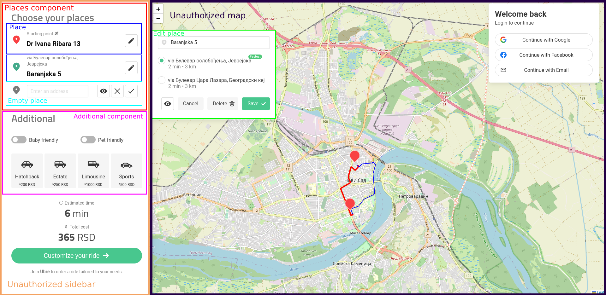

Passenger home page (read the note!)
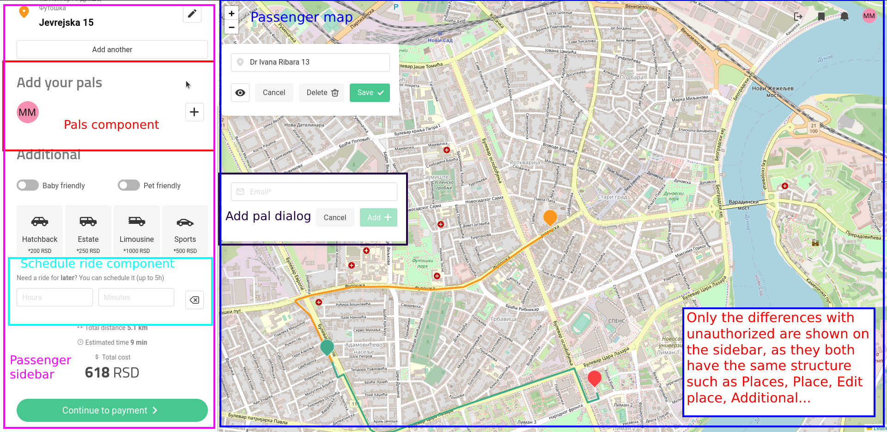

Passenger ride

Here, a finished ride is shown. The same page and components are used for the current/future one so there was no need to add two identical images.
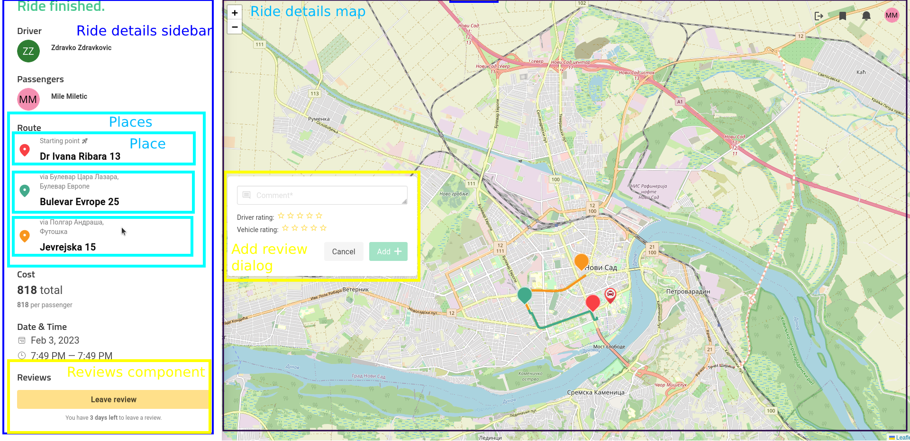

Login
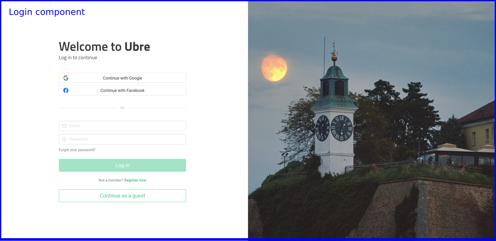

Register, step 1
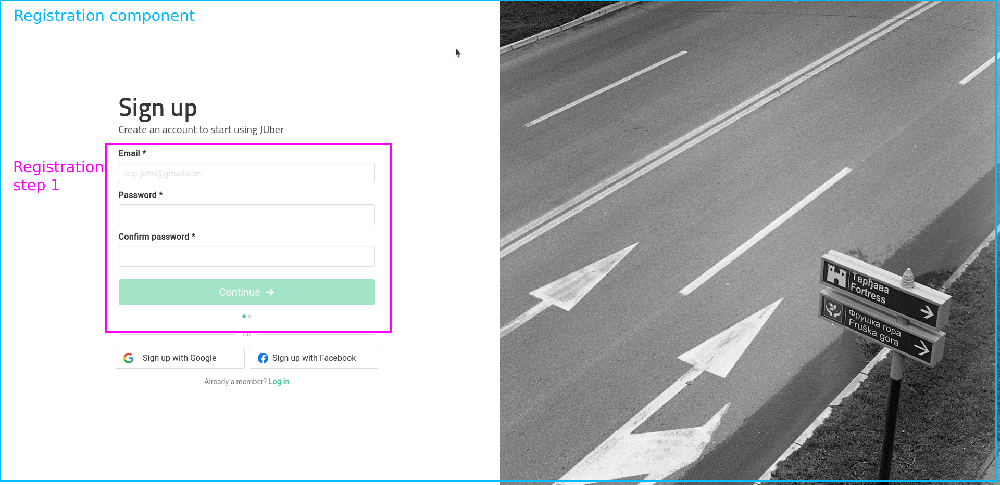

Register, step 2
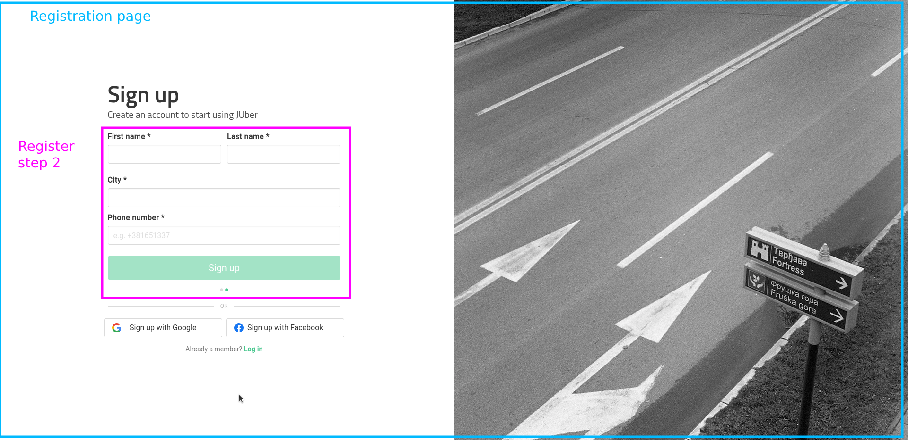

Register, OAuth
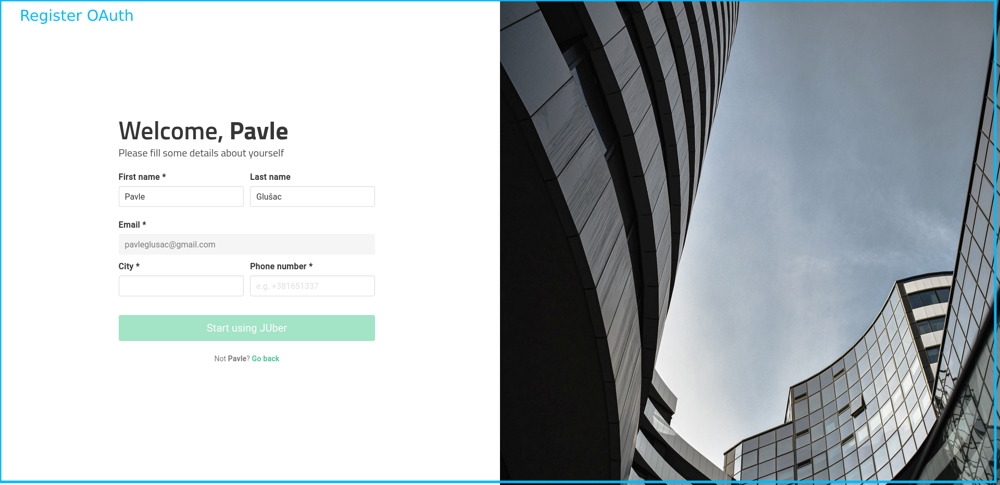

Profile balance
(feel free to send some eth)
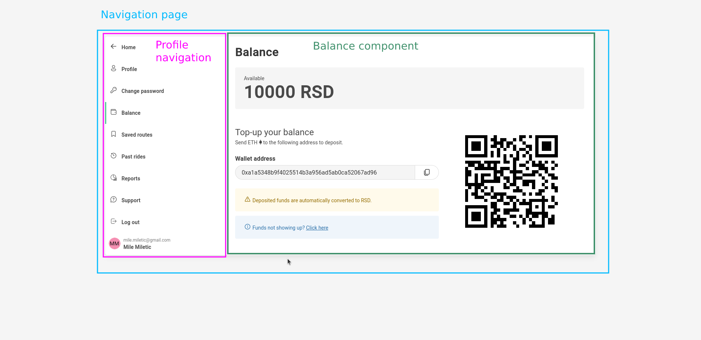

Profile details
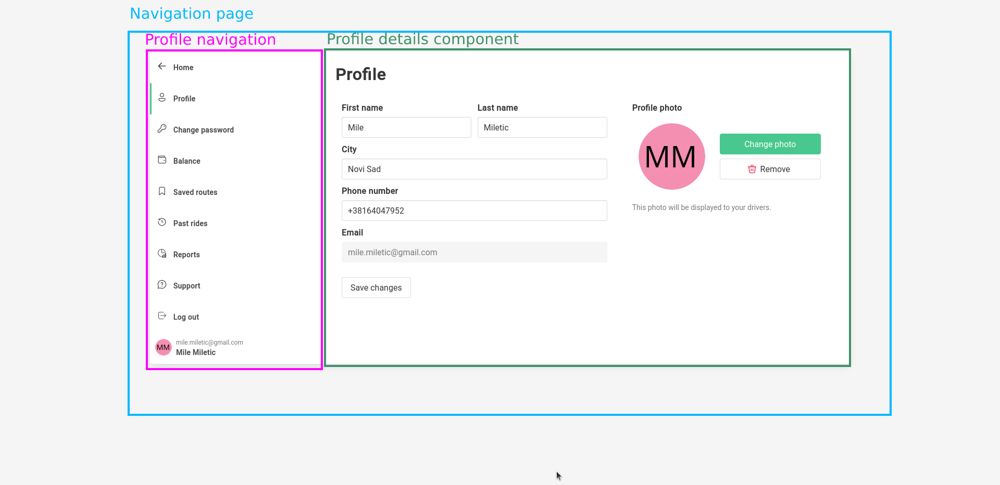

Profile reports
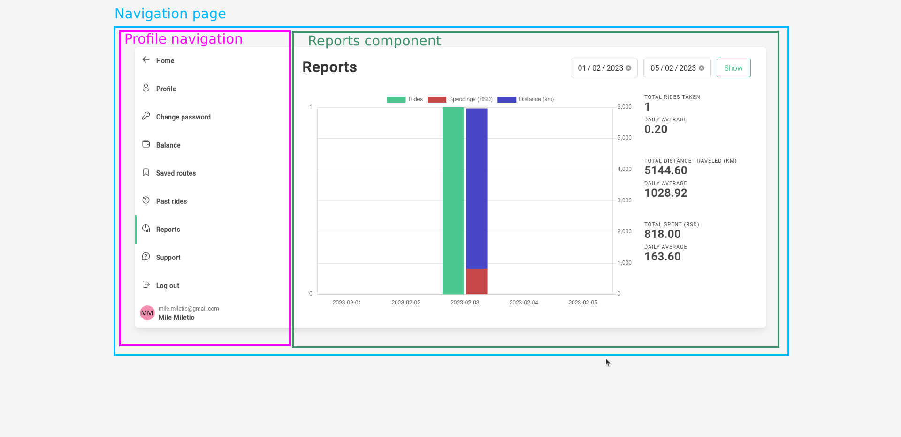

Profile password change 
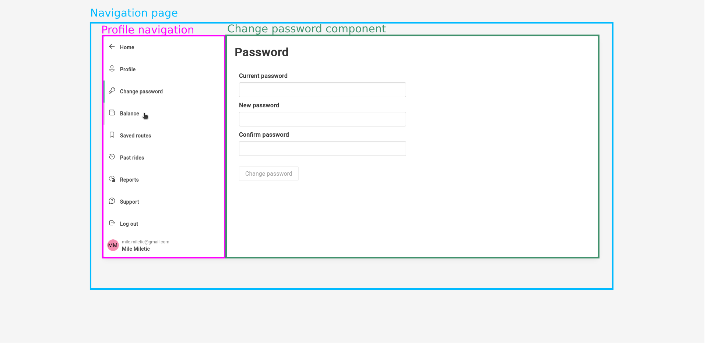

Profile past rides
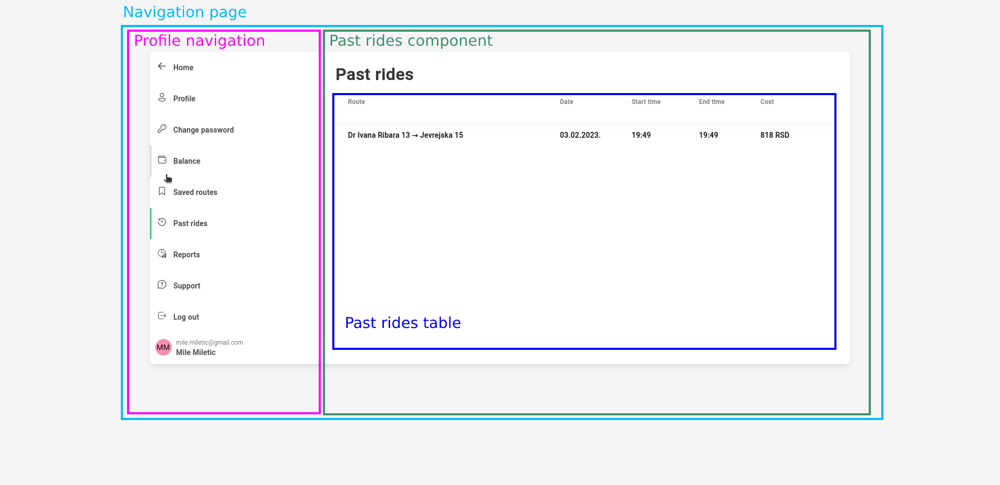

Passenger support
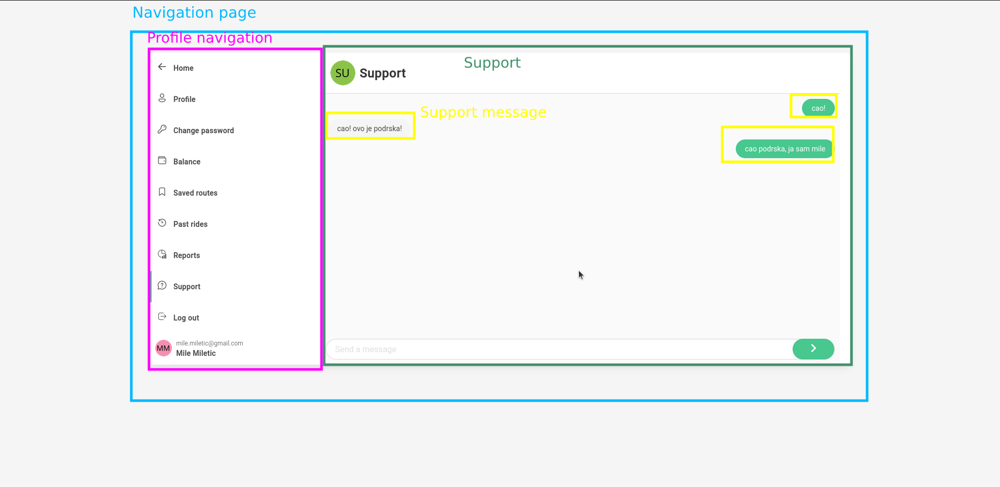

Admin support
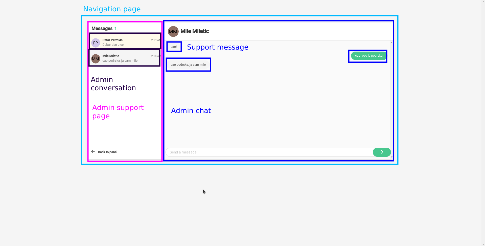

Admin support
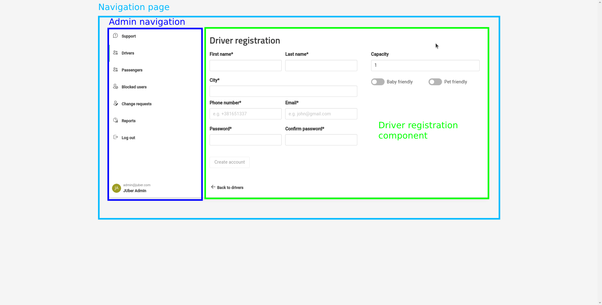

The rest of admin's components are just some tables that were already shown before.

